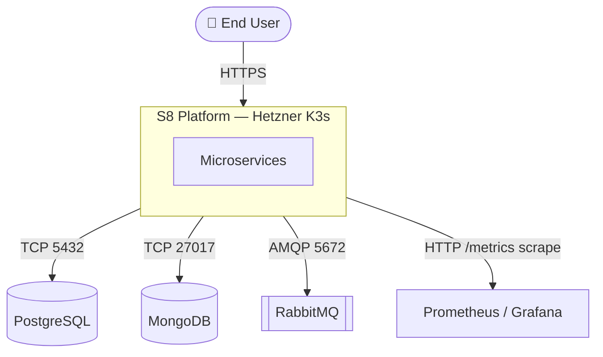
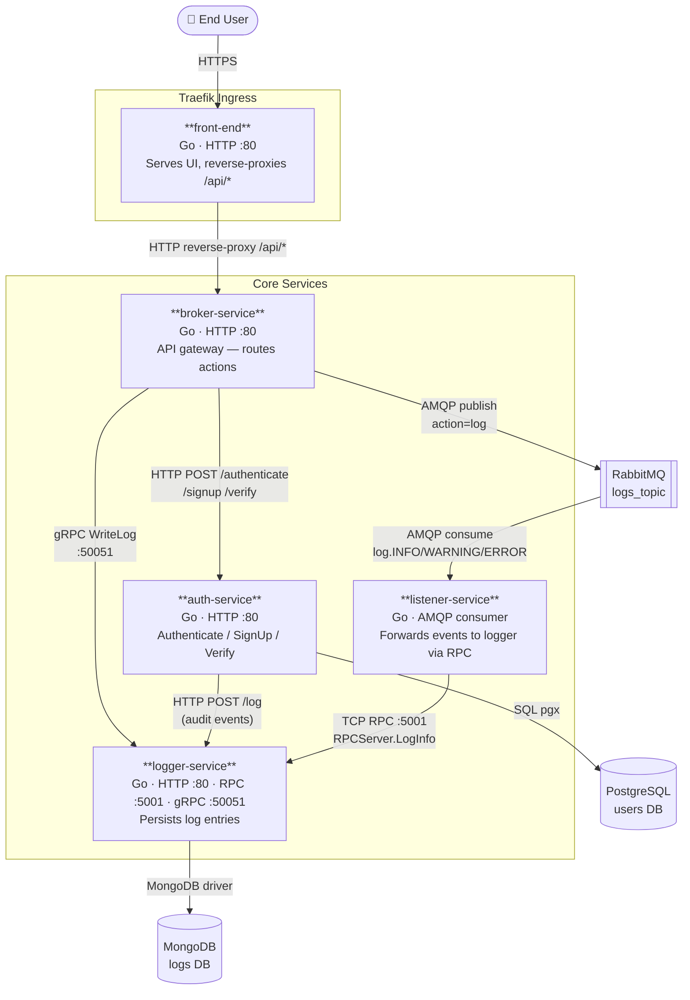
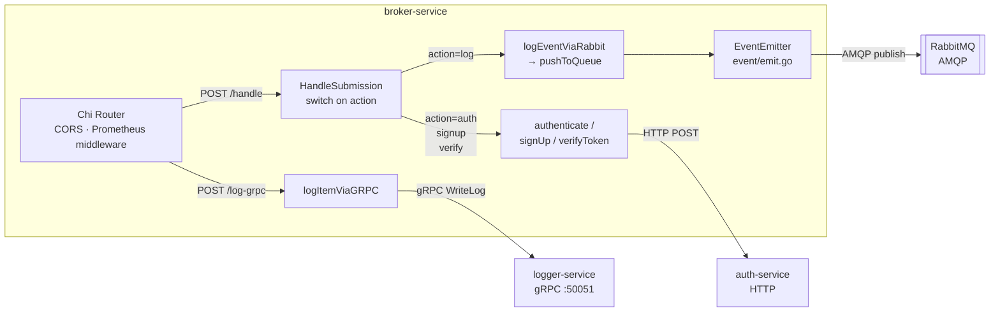
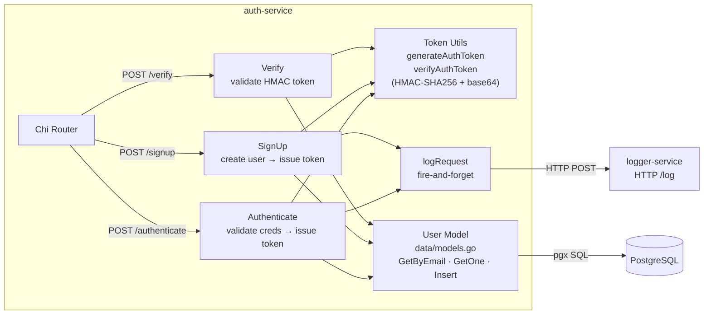
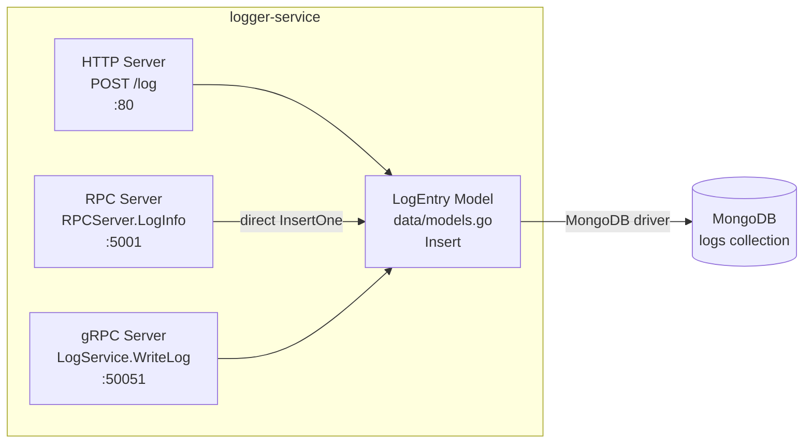
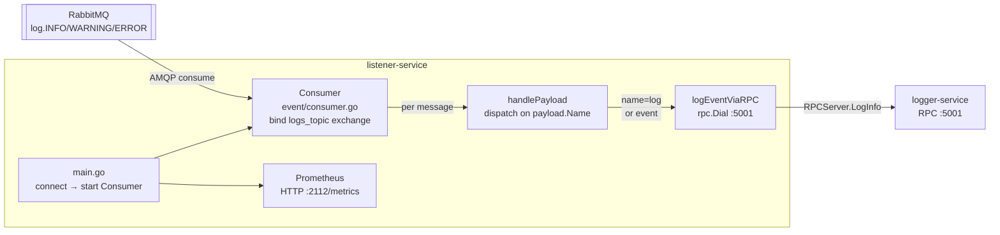
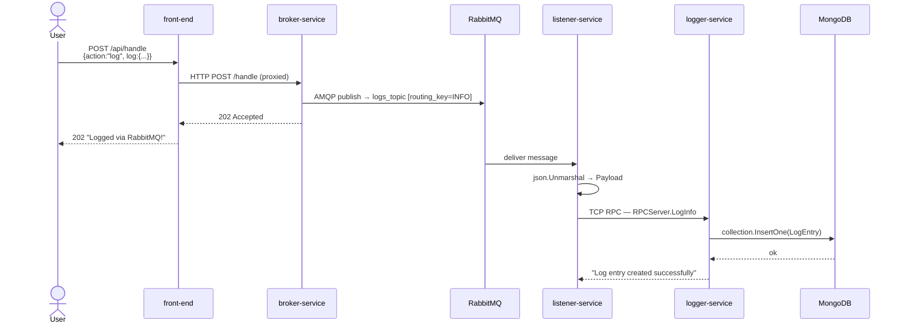

# Architecture Diagrams (C1 → C4)

> Generated from source code. Mail-service excluded (deprecated).

---

## C1 — System Context

---

## C2 — Container Diagram

---

## C3 — broker-service internals

---

## C3 — auth-service internals

---

## C3 — logger-service internals

---

## C3 — listener-service internals

---

## C4 — Request flow: `action=log` (async path)

